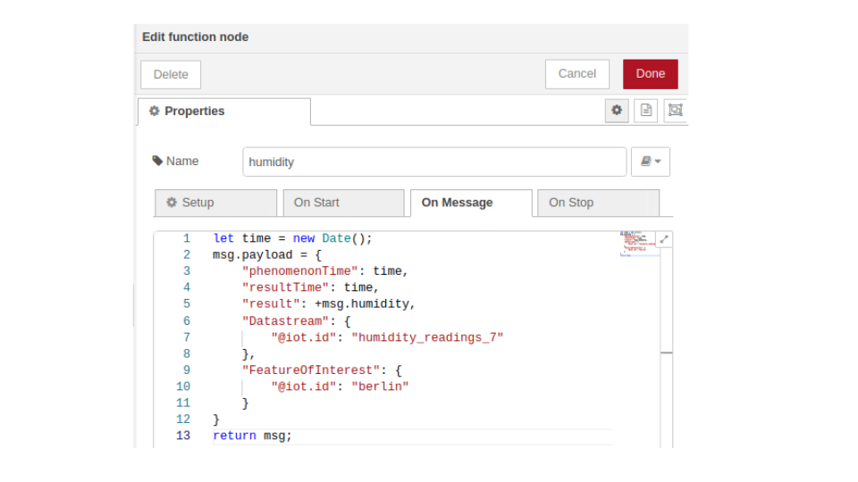
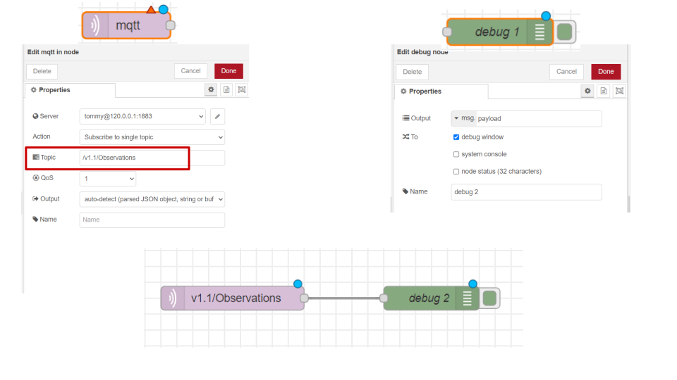

# SensorThings API Data loading via MQTT

In this OER Module, We will learn about IoT protocols, the concepts behind IoT protocols, Sensorthings API and have a glance at one such service: MQTT. The module is intended for students (undergraduates and graduates) who want to learn how to use the SensorThings API services. The entire course is designed to gradually increase your understanding of SensorThings API Data Loading methods. If you are interested in the topic, the course is designed to help by providing relevant and ancillary resources. This course is divided into four chapters, the first chapter deeply explains internet protocols, standards and layers followed by IoT data communication standards in the second chapter; the last two of which are dedicated to practical exercises.

After finishing this course, you will be able to answer:
+ What are Internet protocols and layers
+ Explain SensorThings API(STA)
+ How to use Raspberry pi with Sensor
+ How to load sensor data into STA using MQTT services

## Prerequisites
Before proceeding with the module, you must have a basic understanding of the following concepts: SensorWeb and SensorThings APIs. We recommend looking into the ['SensorWeb'](https://github.com/oer4sdi/OER-SensorWeb/blob/main/Storyboard.MD) module to gain knowledge of the aforementioned concepts.

Time taken: 45 mins

Now, I welcome you all for this journey.

## Chapter 1 : IoT
Kevin Ashton, a tech pioneer, coined the term "Internet of Things" in 1999. The Internet of Things (IoT) is a term used to refer to a network of physical objects, or "things," that are equipped with sensors, software, and other technologies in order to communicate and exchange data with other systems and devices over the internet. These gadgets include everything from common household items to high-tech industrial tools. We frequently think of IoT devices as smart objects that can interact and exchange data over the Internet. Therefore, every device requires an Internet Protocol address in order to be uniquely identified, just like every home requires a postal address. The introduction of IPv6, which provides an almost infinite supply of IP addresses, appears to reinforce this viewpoint.


### Internet Protocol:
The Internet Protocol (IP) is a protocol, or set of guidelines, for addressing and routing data packets so they can move between networks and reach their intended location. The Internet divides data into smaller units known as packets for transmission. Each packet contains IP information, which allows routers to send packets to the correct location. 

We will learn more about IP in the next chapter.

***Did You Know: One of the more obvious benefits of IoT is inventory tracking.***

### 'Thing' in IoT:
Any natural or artificial object that can be given an IP address and can transfer data over a network qualifies as a "thing" in the internet of things. As of right now, there are more than 9 billion "Things" (physical objects) connected to the Internet.

## How Stuff Works?
Individual devices, databases, and gateways that connect multiple networks comprise IoT systems. They communicate with the internet primarily wirelessly and can send and receive data as well as commands. During transmission, sensitive data is protected and secured in the background by security solutions.

### Main Components of IoT
<p align="center">
  
</p>

**Resources** <br/>
<a href="https://www.flaticon.com/free-icons/iphone" title="iphone icons">Iphone </a>, <a href="https://www.flaticon.com/free-icons/gateway" title="gateway icons">Gateway </a>, <a href="https://www.flaticon.com/free-icons/cloud-computing" title="cloud computing icons">Cloud computing </a>, <a href="https://www.flaticon.com/free-icons/result" title="result icons">Result </a>, <a href="https://www.flaticon.com/free-icons/globe" title="globe icons">Globe icons </a> created by Freepik- Smashicons - Flaticon

This is made possible by the interaction of interconnected components like microcontrollers, sensors, and actuators that transform electrical impulses into pressure, movement, temperature, or other mechanical variables. 

#### 1) Sensor
Humans can understand their surroundings through their five senses; machines require sensors to do so. The sensor on an object measures the state of its surroundings, and the data is processed by the system's microcontroller. This could be a simple temperature reading or a complex video feed. The data is then transmitted to software via the network. Thus, they are the most important data suppliers throughout the IoT.

> Can you name some sensors?

#### 2) Gateway 
To send the collected data from the sensor to the cloud, we need a connection. Sensors/devices can be connected to the cloud via cellular, satellite, WiFi, Bluetooth, low-power wide-area networks (LPWAN), or by connecting directly to the internet via ethernet. These are called Gateways. The best connectivity option depends on the IoT application, but they all accomplish the same thing: getting data to the cloud.

#### 3) Data Analytics
After the data is transferred to the cloud, software processes it. This could be something as simple as ensuring that the temperature reading falls within an acceptable range. It could also be very complex, such as using computer vision to identify objects in video (such as intruders in your house)

#### 4) User Interface
The data is then made useful to the end user in some way. This could be accomplished through a user alert (email, text, notification, etc). For example, a text alert when the temperature in the company's cold storage exceeds a certain threshold. The user may also be able to perform an action and influence the system, depending on the IoT application. For example, the user could use an app on their phone to remotely adjust the temperature in the cold storage.

### How One or More IoT Devices communicate?
When two networks or more IoT devices from the same or different networks communicate with one another, this phenomenon is known as communication assistance. Various communication protocols, such as ZigBee, MQTT, Constrained Application Protocol, FTP, and HTTP, among others, can be used to accomplish this. We will look into some of the communication protocols mentioned here in the upcoming chapter.

Look into Geek for geeks working of IoT diagram: 

<p align="center">
  
</p>

### To sum it up:
An IoT system is made up of sensors/devices that communicate to the cloud via some form of gateway. Once the data reaches the cloud, software processes it and may decide to take action, such as sending an alert or automatically adjusting the sensors/devices with/without the user's intervention depending on the use case.

### How does IoT fit with the SensorThings API?
IoT devices and their data can be connected in an open and simple manner thanks to the OGC (Open Geospatial Consortium) SensorThings API standard. IoT therefore requires spatial interoperability, which is made possible by the SensorThings API. This means that location data must be shared and/or combined with location data from other sources. SensorThings' API is specifically designed for IoT devices with constrained resources. The API uses an efficient and user-friendly RESTful design, JSON encoding, and the MQTT messaging transport. 

> SensorThings API is one of the open international standards in the OGC Sensor Web Enablement (SWE) suite. The OGC SWE standards are a well-integrated set of web service interfaces and data encoding specifications. SWE standards enable developers to discover, access, and use all types of sensors, transducers, and sensor data repositories via the Web.

The location-enabled models of the SensorThings API enable sensor feeds from multiple sources to be integrated/aggregated and used more effectively for analytics, modeling, simulations, and so on. IoT application developers can use the OGC SensorThings API to connect to various IoT devices over the Web and create applications without having to worry about the diverse protocols used by various IoT devices, gateways, and services. 

To know more about SensorThings API, look into this module ['SensorThings API'](https://github.com/oer4sdi/OER-SensorWeb/blob/main/Storyboard.MD) to get an introduction.

## Chapter 2 : Internet Protocols

#### How do IoT devices communicate with the web?

A protocol is a set of rules that determines how specific tasks are carried out and how data is formatted in networking so that two or more devices can communicate and understand one another. Network protocols enable easy communication with people all over the world and thus play an important role in modern digital communications. 

Consider this example, speaking the same language simplifies communication between two people. In similar fashion, network protocols allow devices to interact with each other through predetermined rules built into devices' software and hardware. Without network protocols, neither local area networks (LAN) nor wide area networks (WAN) could function as they do today. 

Although there are countless different network protocols, they all generally carry out one of three tasks:
+ Communication 
+ Network Administration 
+ Security

TCP/IP is one among these network protocols. We have a lot of technical words going on so buckle up for a ride.

### What is an IP?
A protocol, or set of guidelines, called the Internet Protocol (IP) is used to address and route data packets so they can move between networks and reach their intended location. The Internet divides data into smaller units known as packets for transmission. Every packet has an IP address attached to it, which enables routers to send packets to the appropriate location. Every device or domain that connects to the Internet is assigned an IP address, and data arrives where it is needed as packets are directed to the IP address assigned to them.  Each IP packet will include both the IP address of the device  and the IP address of the intended recipient, similar to how a piece of mail includes both the destination and return address.

<p align="center">
  
</p>

**Resources** <br/>
<a href="https://www.flaticon.com/free-icons/laptop" title="laptop icons">Laptop icons created by Vectors Market - Flaticon</a>

> Did you find out your IP Address?

Once at their destination, packets are handled differently depending on which transport protocol is used in conjunction with IP. TCP is the most widely used transport protocol, which governs how data is transmitted and received.. The first version of IP (Internet Protocol) was IPv4. After IPv4, IPv6 came into the market, which has been increasingly used on the public internet since 2006.

### TCP/IP model

<p align="center">
  
</p>

**Resources** <br/>
<a href="https://www.flaticon.com/free-icons/laptop" title="laptop icons">Laptop icons created by Vectors Market - Flaticon</a>

TCP/IP is the Internet's backbone: We couldn't surf the Web without these protocols. The TCP/IP model is split into four distinct layers. Used together, they can also be referred to as a suite of protocols.

1. Datalink layer <br/>
The datalink layer (also known as the link layer, network interface layer, or physical layer) is responsible for the physical aspects of sending and receiving data via Ethernet cable, wireless network, network interface card, computer device driver, and so on.

2. Network layer <br/>
The network layer (also called the internet layer) controls the movement of data packets around the network.

3. Transport layer <br/>
The transport layer is responsible for establishing a secure data connection between two devices. It divides the data into packets, acknowledges packets received from the other device, and ensures that the other device acknowledges packets received from it. This is referred to as end-to-end communication.

4. Application layer <br/>
The application layer includes all applications that require network communication. It defines standard Internet services and network applications that can be used by anyone. This is where the user usually interacts, such as with email and messaging.

## IoT Data Communication Protocols
IoT protocols are essential components of the IoT technology stack. Hardware would be useless without IoT protocols and standards. This is because IoT protocols enable communication—that is, the exchange of data or the sending of commands—among all of those various devices.  IoT protocols come in a variety of varieties that have been developed and optimised for specific uses. The type of IoT protocol required is determined by the system architecture layer through which the data will travel.

To connect low-power IoT devices, IoT data protocols are used. They allow users to communicate with hardware without the need for an internet connection. In IoT data protocols and standards, connectivity is accomplished via a wired or cellular network. Here are some examples of IoT data protocols:

### HTTP
> The Hypertext Transfer Protocol (HTTP) is an application-layer protocol used to send hypermedia documents like HTML. It was created to facilitate communication between web browsers and web servers, but it can be used for other purposes as well. 

HTTP follows the traditional client-server model, with a client opening a connection to make a request and then waiting for a response. HTTP is a stateless protocol, which means that the server stores no data (state) between requests. However, in the context of IoT applications, HTTP has a number of disadvantages. For instance, this protocol creates a synchronous connection between two devices in order to transfer data, which poses several difficulties for IoT deployments because devices and endpoints might not be online simultaneously and connections might be unreliable due to network issues.

We transferred our sensor data using HTTP application protocol in the previous course. In this module let’s use another application protocol which is MQTT

### MQTT
> MQTT (MQ Telemetry Transport) is a lightweight messaging protocol designed for Internet of Things (IoT) devices. MQTT is based on the publisher/subscriber model and is managed by a central broker. This means that there is no direct connection between the sender and the receiver. The data sources publish their data, and all recipients with an interest in specific messages receive the data because they have registered as subscribers.

The MQTT protocol is supported by the SensorThings API in addition to the HTTP protocol, which improves the publish and subscribe capabilities of the SensorThings service. SensorThings MQTT adds the ability to create Observation entities via the MQTT protocol. Additionally, a client can send  a MQTT Subscribe request to sign up for notifications when certain entities are updated. MQTT publishers and subscribers are called MQTT clients.

### What’s an MQTT Topic?
MQTT topics are a type of addressing that allows MQTT clients to exchange data. MQTT Topics are organised in a hierarchical structure similar to folders and files in a file system, with the forward slash (/) serving as a delimiter.
+ The topics are case-sensitive. For instance, myhome/temperature and MyHome/temperature are two distinct topics. Furthermore, the slash is a topic in and of itself. 
+ Users can subscribe to a specific hierarchy level of a topic or use a wildcard (#) character to subscribe to multiple levels. For example, myhome/#
+ Topics that start with $ are not part of subscription

### MQTT Client and Broker
An MQTT client is any device that runs a MQTT library, ranging from a server to a microcontroller. One of the reasons MQTT is ideal for small devices is its ease of client implementation. The heart of every Publish/Subscribe protocol is the MQTT broker. A broker can manage thousands of MQTT clients at the same time, depending on the implementation. The functions of the broker are manifold:
+ The broker is in charge of receiving all messages, filtering them, determining who subscribed to each message, and sending the message to those clients who have subscribed. 
+ The Broker keeps track of all persistent clients' sessions, including subscriptions and missed messages. 
+ The Broker is also responsible for client authentication and authorization.
Since, MQTT Broker handles a lot of clients and are frequently exposed to the internet, it is critical that any MQTT broker be highly scalable, easily integrated into backend systems, easy to monitor, and fail-safe.

<p align="center">
  
</p>

**Resources** <br/>
<a href="https://www.flaticon.com/free-icons/temperature" title="temperature icons">Temperature </a>, <a href="https://www.flaticon.com/free-icons/database" title="database icons">Database icons</a> created by Freepik and Smashicons - Flaticon

### MQTT Connection
TCP/IP is the foundation of the MQTT protocol. A TCP/IP stack is required for both the client and the broker.
The MQTT connection is always established between a single client and the broker. Clients are never directly connected to one another. A MQTT client can be a publisher as well as a subscriber depending on the use case.

<p align="center">
  
</p>

**Resources** <br/>
<a href="https://www.flaticon.com/free-icons/database" title="database icons">Database</a>, <a href="https://www.flaticon.com/free-icons/laptop" title="laptop icons">Laptop</a> icons created by Smashicons and Vectors Market  - Flaticon

The client sends a CONNECT message to the broker to initiate a connection. A CONNACK message and a status code are returned by the broker. Once the connection is established, the broker maintains it until the client sends a disconnect command or the connection is terminated. As soon as the client connects to a broker, a client can publish/subscribe to a topic. When a client sends a message to a MQTT broker for publication(PUBLISH), the broker reads it, acknowledges it by sending a PUBACK message to the client (based on the QoS Level), and processes it.

Note: No information is provided to the publishing client by the broker regarding the number of clients who have seen the message or whether anyone is interested in it. It is the broker's responsibility to deliver the message to every subscriber after receiving the PUBLISH message.

The client sends a SUBSCRIBE message to the MQTT broker to receive messages on topics of interest. This subscribe message is very straightforward; it includes a unique packet identifier as well as a list of subscriptions. As an acknowledgement for each subscription, the broker sends the client a SUBACK message. 

We will look into the message workflows in more detail in the coming chapters.

### How to publish/subscribe to a topic?

MQTT employs topic-based message filtering on the broker. Each message must include a topic on which the broker can forward the message to interested clients. Each message typically has a payload that contains the data to be transmitted in byte format. Since, MQTT is data-independent, the sending client (publisher) chooses whether to send binary data, text data, or full-fledged XML or JSON. Messages can be sent with varying levels of Quality of Service (QoS):

<p align="center">
  
</p>

**Resources** <br/>
<a href="https://www.flaticon.com/free-icons/database" title="database icons">Database</a>, <a href="https://www.flaticon.com/free-icons/laptop" title="laptop icons">Laptop</a> icons created by Smashicons and Vectors Market  - Flaticon

### To sum it up:
+ TCP/IP divides each message into packets, which are then reassembled on the other end.
+ While HTTP is an excellent choice for transferring website data, it is not a good choice for an IoT application in general.
+ An MQTT broker's job is to filter messages by topic and then distribute them to subscribers.
+ A client can receive these messages by subscribing to the same broker's topic.
+ A publisher and a subscriber do not have a direct relationship.
+ All clients have the ability to publish (broadcast) and subscribe (receive).
+ Messages are not typically stored by MQTT brokers.

## Chapter 3: Connecting Raspberry Pi with a Sensor using Node-Red
So far we have learned Internet Protocols(IP’s), its standards and layers along with IoT data communication protocols. We also learned about the connection between these standards with SensorThings API(STA). Let’s move to the exciting practical part of this module: Creating an IoT device that can sense temperature and humidity. For that we will use Node Red software.

### Material Required
+ Laptop or PC system (main computer)
+ Raspberry Pi 3 with Raspbian OS installed
+ DHT11 Sensor

### Software Required
+ SensorThings API (STA)
+ Rapsberry pi Imager
+ Node-Red
+ VNC software(Server and Client)

In this tutorial we will use Rapsberry Pi 3 as our microcomputer. You can also use other versions of Raspberry Pi as well.

### Step 1: How to setup Raspberry Pi 3
Raspberry Pis are great because they're cheap and small, but connecting one to its own monitor, keyboard, and mouse takes up a lot more space and money. Since we are just trying to program on the Pi with sensors, there's no need to connect it to a display or input devices because you can control the system remotely from your main computer using a VNC or SSH client. This screenless installation is known as a **headless Raspberry Pi** setup. But first let's install the Rasbian OS for your Raspberry Pi.

a) Watch this easy tutorial to setup Raspberry Pi 3 by M Heidenreich

[](https://www.youtube.com/watch?v=u8bbp79haN4)

b) You can refer to this Official [Guide](https://www.instructables.com/How-to-Setup-Raspberry-Pi-Without-Monitor-and-Keyb/) by Raspberry Pi to setup your Raspberry Pi 3 for indepth understanding. <br/>
c) If you already configured Raspberry Pi without OS installed, with the help of Raspberry Pi [Imager](https://www.youtube.com/watch?v=ntaXWS8Lk34) you can install the OS

### Step 2: Connect Raspberry Pi 3 with DHT11 Sensor

https://user-images.githubusercontent.com/94603960/219872144-ca230252-11fa-4555-ac18-8d6ef2c2116c.mp4

[mp4](Video-format/raspbi_pi.mp4)

Look into [GPIO](https://pinout.xyz/pinout/pin7_gpio4) pin connection to know more about other input and output in raspberry pi.Now your Raspberry Pi is linked to the DHT11 temperature and humidity sensor. The sensor collects the data and sends it to the Raspberry Pi.

### Step 3: Install Node Red in Raspberry Pi 3
Previously we learned how to access Raspberry Pi using headless setup. This is made possible by VNC and SSH.

1. VNC installation

For the next step, we will use VNC to install nodered. You can remotely control your Raspberry Pi from any location using VNC (Virtual Network Computing), which eliminates the need for a monitor and lets you control the desktop interface from another computer or mobile device. SSH, on the other hand, only allows access via the terminal. Both your PC and Rapsberry Pi 3 must be connected to the same network.

Follow this Official guide from VNC on how to [install and connect](https://raspberrypi-guide.github.io/networking/connecting-via-VNC) VNC with Raspberry Pi from your PC.

You can now view your Raspberry Pi in your PC.

2. Node-Red installation

Node-RED is a powerful tool for developing Internet of Things (IoT) applications, with the goal of making the programming component as simple as possible. It employs visual programming, which enables you to connect nodes, to perform a task. To install the Node-Red on Raspberry Pi, Open the Terminal and execute the below command.

```
bash <(curl -sL https://raw.githubusercontent.com/node-red/linux-installers/master/deb/update-nodejs-and-nodered)
```
When the installation is finished, you should see the Node-Red icon in your menu's programming apps list. You can start your node-red using the command: **node-red-start**

**Node-red commands** <br/>
+ node-red-start
+ node-red-stop
+ node-red-log(to view the recent log output)
+ sudo systemctl enable nodered.service (to autostart Node-RED at every boot)
+ sudo systemctl disable nodered.service(to disable autostart on boot)

For accessing the Node-Red portal on the browser in your PC, it should be connected to the same network as Raspberry Pi is connected. Open the Node-Red dashboard by typing this address in the browser
> http://your_Raspberrypi_ip:1880/

**add node palette**

### Step 4: Setup Node-Red in Raspberry Pi 3

Locate and click on Manage Palette once the Node-RED portal has been opened. 

<p align="center">
  
</p>
  
Click on install to download the necessary nodes. You can install them by searching the name shown below.

+ Node-red-contrib-dht-sensor

It will ask for permission to install. Just click on Install.

#### Workflow 1: <br/>


Different nodes are listed on the left hand side. Drag and drop the nodes listed below.
+ inject node
+ rpi-11 node
+ function node

This `inject node` is used to control the interval of sensing data from the sensor.

https://user-images.githubusercontent.com/94603960/219872125-40ce8e02-240a-4e0f-abd0-ef5e50cfbf78.mp4

[mp4](Video-format/sensor_reading.mp4)

## Chapter 4: Data loading via MQTT with Node-Red tutorial

Now that we have a functioning sensor data, let's learn how to load the data to our local SensorThings API (STA) via MQTT. Before any data loading, we need to understand how the STA works. In order to upload the observation, we need to have these entities: things, datastreams, location, observed property, feature of interest. Please see Chapter 4 of our module **'SensorWeb'** to understand the data model in which we used postman to create all of the entities mentioned above. Since Nodered has an inbuilt MQTT client, it’s easier to connect with the MQTT broker of STA. 

#### Workflow 2:


Let’s connect to the STA broker running in our PC to Raspberry Pi using Node-Red. 

**Step 1:** start the docker container of STA in your PC. <br/>
**Step 2:** drag and drop these nodes into the flow region
+ MQTT out: To connect to an MQTT broker
+ Function node: Add any function to transform the sensor data to our desired format in STA

**Step 3:** double click the `MQTT out node`.

<p align="center">
  
</p>

Click add

<p align="center">
  
</p>

**Step 4:** for example, I have used tommy as my Client ID. Now, add the topic in the `MQTT out node` (remember that MQTT has a hierarchy based system for its data communication)

**Step 5:** specify the Quality of Service(Qos). I have selected QoS 1(for most of the projects, QoS 1 is best suited). Click done.

Whew, that's a hefty amount of work. Pat yourself in the back. Now, let’s load our sensor data into STA Observations.

**Step 6:** double click the `function node`. Edit the name with your choice of label(here, temperature). Since, the STA Observation entity has some mandatory properties to be filled, let’s create the json structure in the function payload.

<p align="center">
  
</p>

Let's look at how we can format the structure: We can get the phenomenon time parameter for the observation from the Javascript built-in library 'Data'; because our sensor senses temperature directly, the result time and phenomenon time are the same. The msg.payload from the `rpi node` would now be the result. Datastream and feature of interest entities from the Observation UML diagram should be included by adding the already formed entities here. The resultQuality, validTime and parameters are the optional properties of the observation entity and shouldn't be necessary here.

**Step 7:** connect the `function  node` with the `rpi node` and connect the  `mqtt out node` with the `function  node`. Click `deploy`.

Now, open the browser of your PC and type this address: 
> localhost/8081/v1.1

If everything works fine, you can already see your observations getting loaded into your STA.

#### Workflow 3:


**Step 8:** Now, let’s do the same with humidity. For the humidity `function  node` json format: use `humidity datastreams id `and remember how the sensor gives the data(see the debug message from the sensor).

<p align="center">
  
</p>

**Step 10:** If you want to stop your MQTT upload, you can do so by disabling the `MQTT out node`. The flows are saved and you can stop the Node-Red by stopping Node-Red in the cmd.

**Step 11:** Stop the Node-Red by typing **node-red-stop** or **ctrl+c** in the command prompt.

You have successfully uploaded your sensor data into STA via MQTT using Node-Red.

#### Workflow 4:

So far we have learned how to connect to an MQTT broker and publish our sensor data. Now, let’s subscribe to our uploaded sensor data and see how it works: To do that, drag and drop these nodes <br/>
+ MQTT in node
+ Debug node

**Step 12:** Double click MQTT in node and Set the localhost and mention the topic (path) that you want to subscribe to. Click done.

<p align="center">
  
</p>

**Step 13:** Double click debug node and set the output as in the diagram above. 

**Step 14:** Connect the output port of the MQTT in node with the input port of the debug node. Click deploy.

You can now see the observations in the json format required by STA in the debug window. To stop the observations being uploaded, double click the `MQTT out` node and in the bottom most corner click the enable button once to disable the node. The same goes for all the nodes in the node-red flow panel. Congratulations for finishing up this practical module
